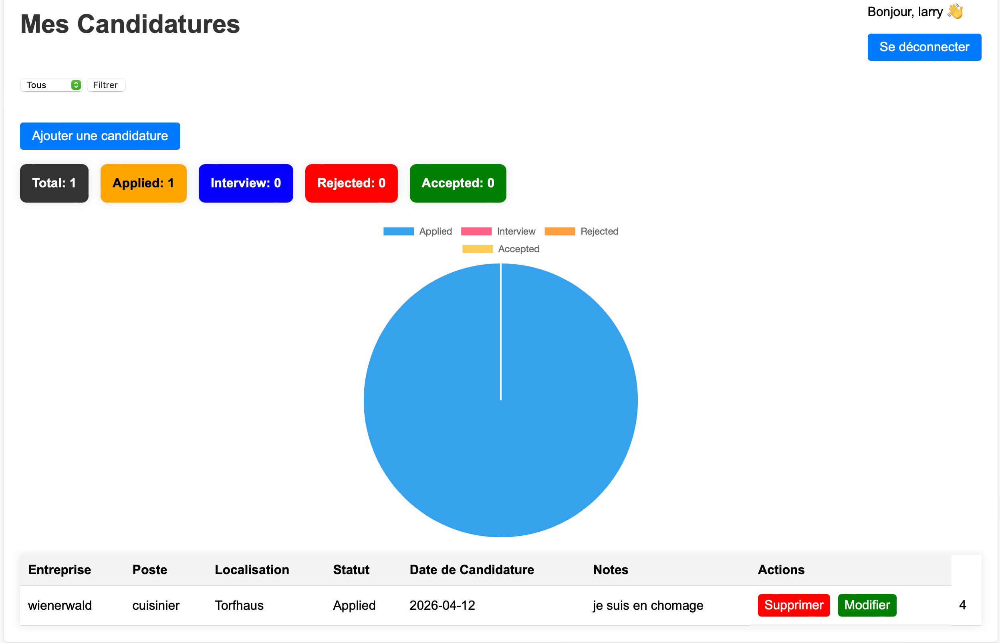

# Job Application Tracker
## Description
This project is a web application that helps users track their jon applications efficiently.
Users can manage their applications, update their status, and visualize their porgress with a dashboard.

## Features

### Authentication

- User authentication (Loging/ Register / Logout )
- Add, edit, delete job applications
- View applications in Dashnoard 
- Status tracking(Applied, Interview, Rejected, Accepted)
- Statistics dashboard with Chart.js
- Clean dand responsive design
- Secure access per user

## Technologies Used 

- PHP (PDO)
- MySQL
- HTML / CSS
- Git & GitHub
- Apache (XAMPP)
- JavaScript (Chart.js)

## Project Structure

- register.php → user registration
- login.php → user authentication
- dashboard.php → Display applications
- create_application.php → Add application
- delete_appliation.php → Delete application
- logout.php → session destruction
- config/database.php → Database connection
- assets/ → CSS and JS files

## Installation

1. Clone the repository: git clone https://github.com/azanguim123/Job-application-tracker.git
2. Move the project to XAMPP:  C:\xampp\htdocs\projects/job-tracker
3. Create the database:
- Name: `job_tracker`
4. Create the table `users` with fields:
- id
- full_name
- email
- password
- created_at
5. Configure the database connection in:  `config/database.php`
6. Run in browser: `http://localhost/projets/job-tracker/`

### Authentication

- User registration with validation
- Password hashing for security
- Login system with session management
- Protected dashboard (only accessible when logged in)
- Logout functionality

### Job Applications Management

- Add new job applications 
- Store application details (company, job title, location, status, date, notes)
- View all applications in a dashboard
- Edit job application
- Delete applications
-  Each application are linked to the authenticated user

## Dashboard

The dashboard allows users to: 
- View all their job applications in a table
- See details such as company, job title, location, status, and application date, and notes
- Manage their job search efficiently

## What I learned

- Using PHP with PDO for secure databse access
- Handling user authentication and sessions
- Performing CRUD operations(Create, Read, Update, Delete)
- Building dynamic dashboards
- Integration Chart.js for data visualization
- Structuring a full web project

## Screenshots

## Future Improvements

- Deploy the application online
- Updload CV/documents
- Email notifications
- Mobile optimization improvements

## Project Status

This project is currently under development.
Core features such as authentication and application tracking are implemented.

## Author

Azanguim Ndongmo Larry Nelson
 Master's Student in Computer Science
 Passionate about Web Development and Software Engineering